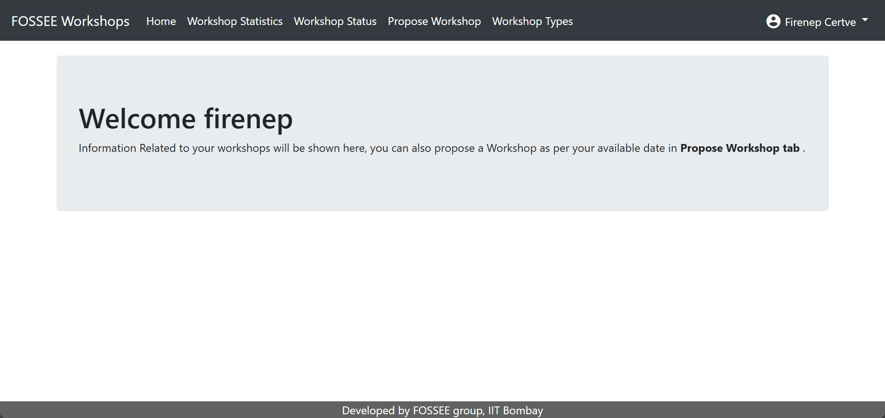
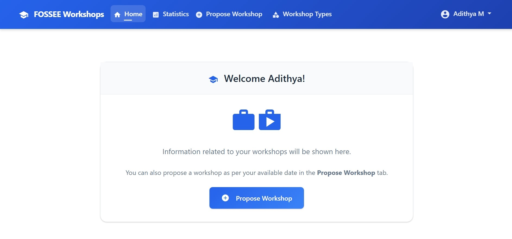
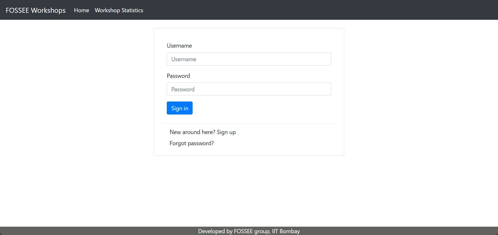
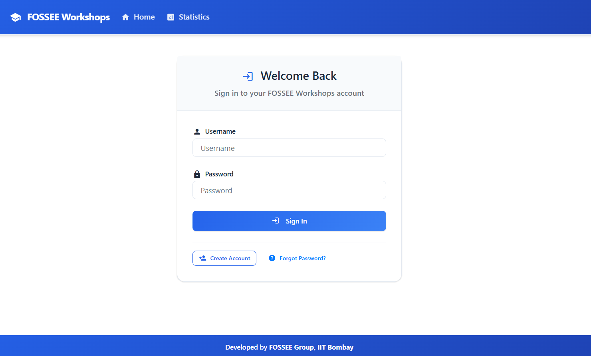
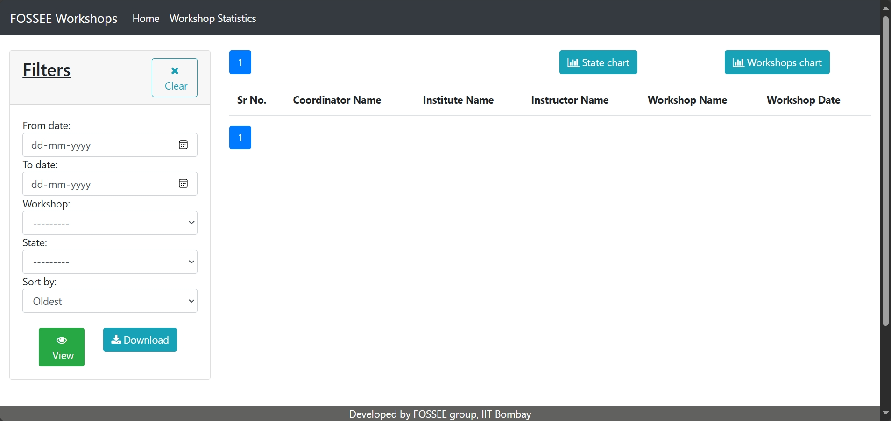
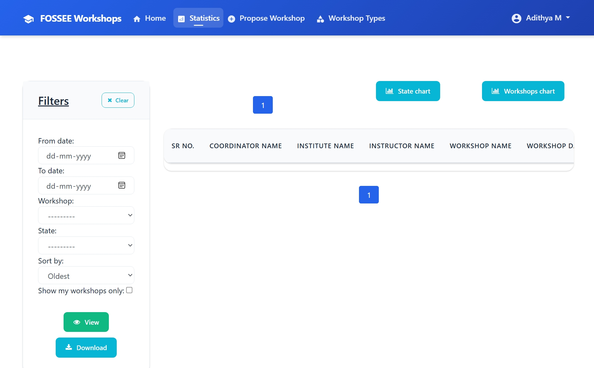
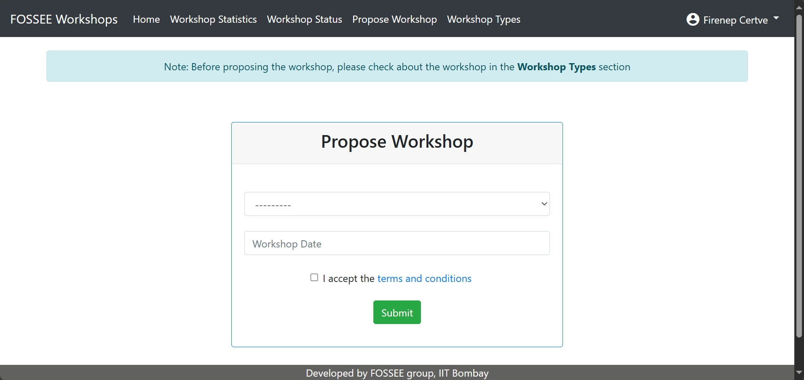
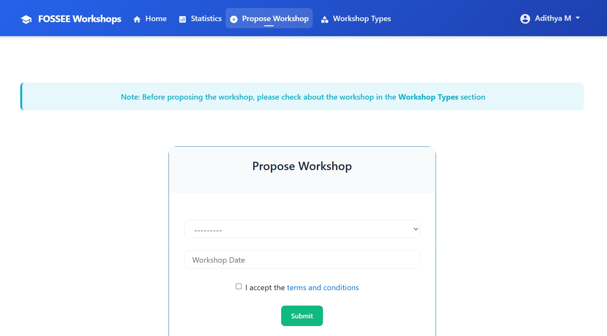

# **Workshop Booking**

Workshop Booking is a simple portal where coordinators can request and manage workshops with FOSSEE instructors. Coordinators can browse types, check stats, and propose dates that work for them.

---

## UI/UX Improvements

The following changes were implemented to enhance usability while keeping the core structure intact:

- Improved navbar spacing, mobile dropdown behavior, and tap targets
- Reduced and standardized footer height with clear credit line
- Fixed tables overflowing on small screens with responsive wrappers
- Refined card spacing to prevent clipping and layout shifts
- Normalized button sizes (`.btn`, `.btn-sm`, `.btn-lg`, `.btn-xl`) and added responsive utilities
- Added quick access to Login from `register.html`


### What design principles guided your improvements?
I leaned on clarity, consistency, and hierarchy. First, I made the interface breathe: tighter, consistent paddings; clear section breaks; and a readable typographic scale so important actions stand out without shouting. I kept patterns predictable (same button sizes everywhere, familiar placements for actions), and improved contrast and touch targets so the app feels comfortable on a phone and still tidy on a laptop.

### How did you ensure responsiveness across devices?
I built mobile‑first and scaled up. The layout uses Bootstrap’s grid with breakpoints at 992/768/576px, so the Filters panel stacks above the table on small screens and sits beside it on larger ones. Data tables can overflow inside a `.table-responsive` wrapper only, which prevents full‑page sideways scrolling. Utility classes like `.btn-full-mobile` and `.btn-group-responsive` let controls resize and reflow without special cases.

### What trade-offs did you make between the design and performance?
I favored CSS over JavaScript and reused Bootstrap/JS already in the project instead of adding new libraries. Subtle shadows and gradients help with depth but stay light to avoid extra paint cost. The trade‑off is a bit more CSS to keep spacing and sizing consistent, but the payoff is faster interaction and fewer moving parts.

### What was the most challenging part of the task and how did you approach it?
The mobile navbar dropdown. It failed due to script order and our own collapse handler catching clicks. I fixed the load order (Popper before Bootstrap), guarded the collapse logic so it ignores dropdown toggles, explicitly initialized dropdowns, and increased tap/margin spacing so the menu is easy to use on touch devices. I verified the behavior on narrow viewports after each tweak.

---

## Getting Started

Prerequisites
- Python 3.x and pip

Setup
1. Clone the repository
   ```bash
   git clone https://github.com/FOSSEE/workshop_booking
   cd workshop_booking
   ```
2. Install dependencies
   ```bash
   pip install -r requirements.txt
   ```
3. Migrate and run
   ```bash
   python manage.py migrate
   python manage.py runserver
   ```
4. Open `http://127.0.0.1:8000/`

---

## Visual Showcase

Below are before/after comparisons of key screens. All screenshots are in `screenshots/before/` and `screenshots/after/`.

### Homepage
Before


After


### Login
Before


After


### Statistics
Before


After


### Propose Workshop
Before


After



---

## Notes
- Screenshots are added to `screenshots/before/` and `screenshots/after/`.
- Changes focus on better readability on phones, consistent spacing, and smoother navigation without adding heavy libraries.

